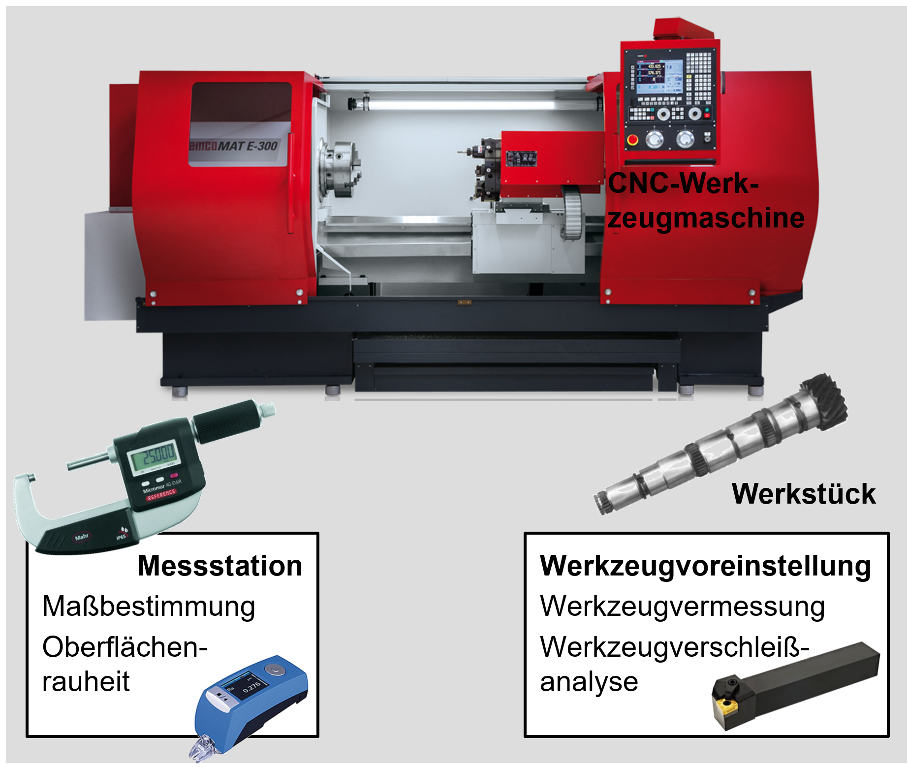
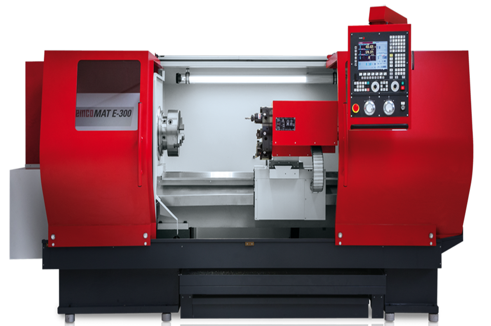
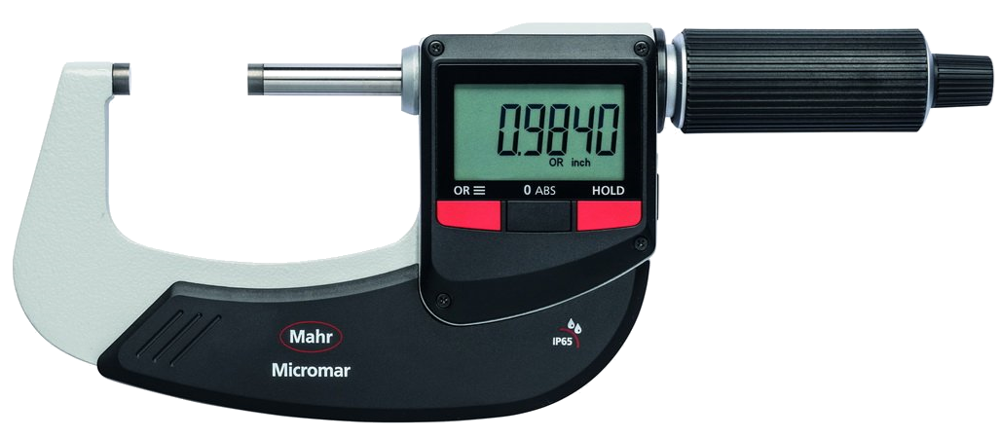

<!--

author:   Nancy Brinkmann, Ronny Stolze

email:    nancy.brinkmann@hs-magdeburg.de, ronny.stolze@hs-magdeburg.de

version:  1.0.0

language: de_DE

narrator: DE FEMALE

-->

# Verwendete Maschinen- und Gerätetechnik

Hier finden Sie einen Überblick zur im Praktikum "Drehen" verwendeten Maschinen-    und Gerätetechnik. Nutzen Sie die folgenden Informationen, um sich mit der Technik vertraut zu machen und zur Vervollständigung des anzufertigenden Protokolls.

 
<!--
style = "width: 100%; "
-->

## Werkzeugmaschine

~~**Drehmaschine**~~

<!--
style = "width: 100%; "
-->

*EMCOMAT E-300, zyklengesteuert*

 
**Eigenschaften**
* Spitzenweite:	1.500 mm
* Umlauf-∅ über Bett:	570 mm
* Umlauf-∅ über Schlitten:	340 mm
* Vorschubkraft X: max.	1.000 daN
* Vorschubkraft Z: max.	1.500 daN
* Spindeldrehzahl:	0 - 2.500 U/min
* Drehzahlregelung:	stufenlos
* Antriebsleistung bei 40/100 % ED:	25/17 kW
* max. Nennmoment an der Hauptspindel:	764/519 Nm

## Kraftsensorik

~~**Dynamometer**~~

**image**<!--
style = "width: 100%; "
-->

*Name*

 

**Eigenschaften**

 

~~**Ladungsverstärker**~~

ICAM - programmierbarer, industrieller Ladungsverstärker 
3-Kanal, BNC-Eingangsstecker 
* Messbereich: ±100 ... 1 000 000 pC
* Anzahl Kanäle: 3
* Ladungseingang: BNC neg.
* Ausgangssignal: -10 ... 10 V
* Schnittstelle: RS-232C
 

~~**Analog-/Digitalwandler**~~

## Werkzeuge

~~**Werkzeughalter**~~

 

~~**Wendeschneidplatten**~~

## Rauheitsmessung

~~**Rauheitsmessgerät**~~

**image**<!--
style = "width: 100%; "
-->

*Hommel Etamic T1000*

 
**Eigenschaften**

 

~~**Software: Waveline Evovis Mobile**~~ 

PC- basierendes Auswerteprogramm für  mobile Rauheitsmessgeräte: 
Funktionsbereiche
* direkte Messplatzsteuerung des angeschlossenen Rauheitsmessgerätes
* Auswertung offline erfasster Messungen(Rauheitsprofile)
* Auswertung offline erfasster Messungen(Kenngrößendateien)
* Datenexport Merkmals- und Profildaten

## Durchmessermessung

~~**Digitale Bügelmessschraube**~~

<!--
style = "width: 100%; "
-->

*Micromar 40 EWRi mit Funkadapter, Mahr*

 
**Eigenschaften**

* reduzierte Messflächen Ø 3 mm
* MarConnect (Bidirektional)
* USB
* IP 65
* Einstellmaß (Messbereich 75 - 100 mm)
* Ziffernschrittwert	0,001 mm
* Ziffernschrittwert	0,00005 in
* Fehlergrenze µm	3 µm
* Parallelitätsabweichung in µm	3 µm
* Ebenheitsabweichung in µm	0,6 µm
* Spindeldurchmesser	6,5 mm
* Spindelsteigung	0,5 mm
